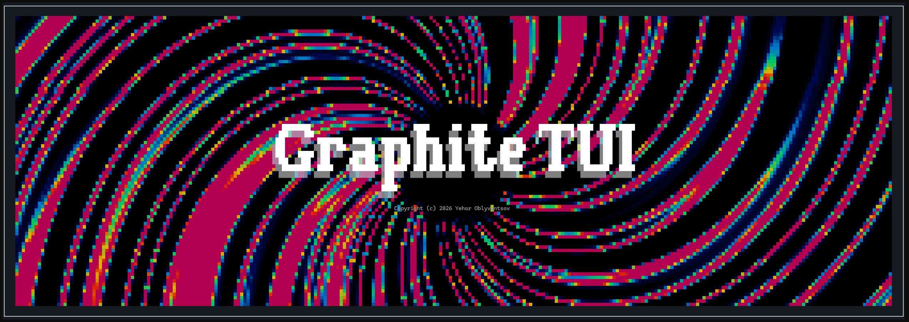

# Graphite




A small terminal UI (TUI) widget library for Go: a double-buffered canvas
with a diffing renderer and truecolor (24-bit RGB) rendering, a `Widget`
interface with focus/enabled/visible state handled for you, a `Flex`
layout container, and a set of ready-made widgets (labels, buttons,
checkboxes, input boxes, text areas, list boxes, todo lists, tabs, progress
bars, panels for layout, modal windows, a mixing-console `Fader`, and a
playable `PianoRoll` keyboard with real MIDI and audio companion
packages). The library's own dialogs, file picker, and value editor ship
with [prepared translations](docs/i18n.md) into 15 languages, and any
program built with it can register translations of its own.

## Quickstart

```bash
git clone https://github.com/yeoblyv/graphite.git
cd graphite
go run ./showcase   # every widget, Flex layout, and a custom theme in one window
go run ./gphedit     # a GPH image editor/converter built with Graphite
go run ./promo       # an animated logo/splash screen
```

Minimal usage from your own program:

```go
package main

import "github.com/yeoblyv/graphite"

func main() {
	app := Graphite.NewApplication()

	win := Graphite.NewWindow(50, 10, " Hello ")
	win.AddWidget(Graphite.NewLabel(2, 2, "Hello, terminal!"))
	win.AddWidget(Graphite.NewButton(2, 4, "Quit", Graphite.BtnDefault, func() {
		app.Quit()
	}))

	app.SetWindow(win)
	app.Run()
}
```

`Esc` quits the application (or closes the topmost modal, if one is open);
`Tab` cycles focus; arrow keys and mouse clicks both work out of the box.

## Documentation

Full documentation lives in [`docs/`](docs/getting-started.md):

| Document | Covers |
|---|---|
| [Getting started](docs/getting-started.md) | Install, minimal program, running the example programs |
| [Architecture](docs/architecture.md) | `Application`, `Canvas`, `Window`, `Widget`/`BaseWidget`, the render/input loop, concurrency |
| [Layout](docs/layout.md) | Fixed/percentage positioning, the stretch rule, `Panel`, `Flex`, `GroupBox` |
| [Theming](docs/theming.md) | `Color`, `Theme`, `DefaultTheme`, building a custom palette |
| [Events](docs/events.md) | `Event`, `EventType`, `KeyCode`, mouse/keyboard routing |
| [Widgets reference](docs/widgets.md) | Every widget except `Fader` and modals: `Label`, `Button`, `InputBox`, `ListBox`, `TabView`, `Slider`, etc. |
| [Fader](docs/fader.md) | The channel-strip mixer control, in depth |
| [PianoRoll](docs/pianoroll.md) | The playable piano keyboard, plus the `graphite/audio` and `graphite/midi` companion packages for real sound and real MIDI hardware |
| [Modals](docs/modals.md) | The modal stack, `ShowMessage`, `ShowValueEditor`, `ShowFilePicker` |
| [Internationalization](docs/i18n.md) | `Locale`, `Application.T`, prepared translations, and adding your own language |
| [Images](docs/images.md) | The GPH pseudographics image format and the `Image` widget |
| [Custom widgets](docs/custom-widgets.md) | Building your own widget by embedding `BaseWidget` |
| [Windows terminal notes](docs/windows-terminal.md) | The `conhost.exe` virtual-terminal-processing fix, and why it's needed |

## Building

This repo ships two ways to build, so you don't need to install anything you
don't already have:

- **`make`** (Linux/macOS/CI, or Windows with Make installed):
  ```bash
  make build          # compile everything for the host platform
  make build-all       # cross-compile the example programs for
                        # windows/amd64, windows/386, linux/amd64, linux/386
  make test            # go test ./...
  make lint             # golangci-lint, if installed
  ```
- **PowerShell** (native on Windows, no extra tools):
  ```powershell
  ./build.ps1                      # cross-compile for all four targets
  ./build.ps1 -Target linux-amd64  # a single target
  ./build.ps1 -Target Test         # go test ./...
  ```

Both write cross-compiled binaries to `dist/<goos>_<goarch>/`.

## Architecture at a glance

`Application` owns the terminal, the canvas, the active window, and the
modal stack, and drives the render/input loop (`Run`) — the one
composition root a program constructs, with no package-level mutable
state to reason about. `Canvas` is a double-buffered grid of cells that
`Render` diffs each frame, writing only what changed. `Widget` is the
interface every UI element implements; `BaseWidget` handles the
mechanical parts (layout resolution, focus/enabled/visible state) so
concrete widgets only implement drawing and event handling. `Window`
hosts a widget tree, resolves Tab order, and routes mouse/keyboard
events, including the implicit mouse capture that lets a drag continue
past a widget's own bounds — the same model every desktop GUI toolkit
uses. `Flex` distributes space among children along one axis by weight,
CSS-flexbox-style. `Fader` is a full mixing-console channel strip (gain,
an independent VU meter, a clip indicator, Mute/Solo). `PianoRoll` is a
playable piano keyboard (mouse, PC keyboard, or real MIDI hardware via
the separate `graphite/midi` package), with `graphite/audio` providing
real sound. Updating a widget
from a background goroutine must go through `Application.Invoke`, the
only thread-safe way to touch widget state from outside the render loop.

Full detail on every one of these — including worked examples — is in
[`docs/`](#documentation) above, starting with
[Architecture](docs/architecture.md).

## Security notes

Two things worth knowing about this library's threat model:

- **Untrusted text is sanitized before it reaches the terminal.**
  `Canvas.DrawCell` replaces any single-rune string that's a raw control
  character with a space before writing it, so a widget displaying
  untrusted content (e.g. subprocess output streamed into a `TextArea`)
  can't have that content inject arbitrary ANSI/OSC escape sequences —
  title-bar spoofing, color/state resets, or worse — into the user's real
  terminal. Multi-rune strings (the box-drawing/block-element glyphs
  widgets themselves draw) pass through unchanged, since those come from
  trusted library code, not user-supplied data.
- **Widget selection indices are bounds-checked against the current data**,
  not assumed from a stale clamp — `ListBox`/`TodoList`/etc. re-validate
  `Selected` against the live length of `Items` at the point of use, so a
  caller reassigning `Items` to a shorter slice at runtime (e.g.
  re-filtering a list) can't leave `Selected` pointing past the end and
  cause an out-of-bounds read.
- **This library does not protect against a malicious terminal emulator**
  — it assumes the terminal it's talking to correctly implements the SGR
  mouse/color/alternate-screen sequences it uses and isn't itself hostile.
  It also does not sanitize file paths passed to `ShowFilePicker`/`gph.go`'s
  file I/O helpers beyond what the OS itself enforces — treat paths from
  those APIs the same as any other filesystem path your program handles.

## Contributing

See [CONTRIBUTING.md](CONTRIBUTING.md).

## License

[MIT](LICENSE)
